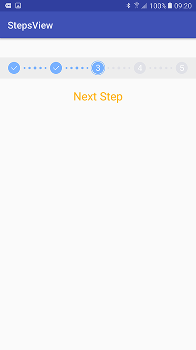
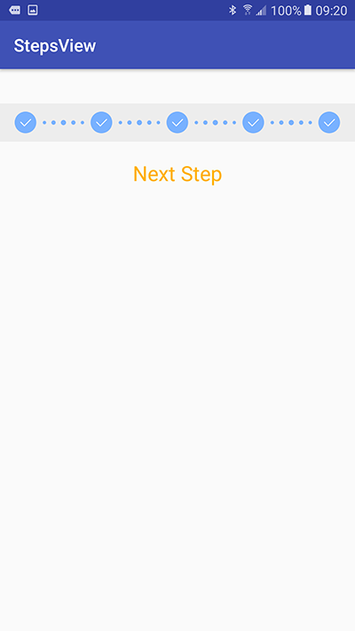

# StepsView
基于android的步骤控件
<br>
## Feature
- 实现了自定义步骤
- 随意跳转步骤
- 使用非常简单

## 用法
###1.首先在xml中定义好
```xml
<cn.appleye.stepsview.StepsView
        android:id="@+id/steps_view"
        android:layout_width="match_parent"
        android:layout_height="44dip"
        android:background="#ededed"/>
```
###2.当要跳转到某个步骤，添加步骤监听，使用下面代码即可
```java
mStepsView = (StepsView) findViewById(R.id.steps_view);
mStepsView.setStepsCount(5);
mStepsView.setStepChangedListener(new StepsView.OnStepChangedListener(){
	public void onStepChanged(int stepIndex){

	}
}
});

mNextView = findViewById(R.id.next_step_view);

mNextView.setOnClickListener(new View.OnClickListener() {
	@Override
	public void onClick(View view) {
		mStepsView.nextStep();
	}
});   
```
###效果图


 

# About
@Author : Liu Liaopu </br>
@Website : https://github.com/newhope1106

# License
Copyright 2015-2016 Liu Liaopu

Licensed under the Apache License, Version 2.0 (the "License"); you may not use this file except in compliance with the License. You may obtain a copy of the License at

http://www.apache.org/licenses/LICENSE-2.0

Unless required by applicable law or agreed to in writing, software distributed under the License is distributed on an "AS IS" BASIS, WITHOUT WARRANTIES OR CONDITIONS OF ANY KIND, either express or implied. See the License for the specific language governing permissions and limitations under the License.   